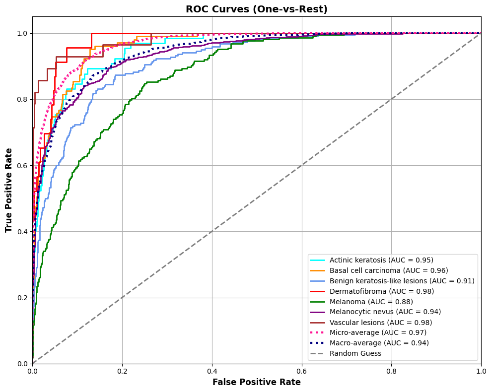

# 🔬 Skin Cancer Classification with EfficientNetB3

Deep learning model for automated skin lesion classification using dermatoscopic images from the HAM10000 dataset.

---

## 🎯 Project Overview

This project tackles the challenging task of classifying skin lesions into seven diagnostic categories. The main challenge? **Severe class imbalance** – with some lesion types having 50× more samples than others.

**Solution:** EfficientNetB3 architecture with Focal Loss to handle the imbalance without artificially duplicating minority class samples.

### Key Results
- **Test Accuracy:** 77.13%
- **Melanoma Recall:** 63.68% (critical for cancer detection)
- **Macro AUC:** 0.94 (excellent discrimination across all classes)

---

## 📁 Dataset

The [HAM10000 dataset](https://www.kaggle.com/datasets/kmader/skin-cancer-mnist-ham10000) contains 10,015 dermatoscopic images across seven diagnostic categories:

| Class | Full Name | Samples | Risk Level |
|-------|-----------|---------|------------|
| **mel** | Melanoma | 1,113 | High ⚠️ |
| **bcc** | Basal cell carcinoma | 514 | High ⚠️ |
| **akiec** | Actinic keratoses | 327 | Moderate 🟡 |
| **bkl** | Benign keratosis | 1,099 | Low ✅ |
| **nv** | Melanocytic nevi | 6,705 | Low ✅ |
| **vasc** | Vascular lesions | 142 | Low ✅ |
| **df** | Dermatofibroma | 115 | Low ✅ |

**Data Split:** 60% training / 20% validation / 20% test (stratified)

> **Challenge:** The dataset exhibits severe class imbalance with a 58:1 ratio between the largest (nv: 6,705) and smallest (df: 115) classes, presenting significant challenges for minority class detection.

---

## 🧠 Model Architecture & Training

### Base Model
- **Architecture:** EfficientNetB3 (pretrained on ImageNet)
- **Input Size:** 300×300×3
- **Strategy:** Transfer learning with frozen base layers

### Custom Head
```
GlobalAveragePooling2D
    ↓
Dense(384, swish) → BatchNorm → Dropout(0.3)
    ↓
Dense(128, swish) → BatchNorm → Dropout(0.21)
    ↓
Dense(7, softmax)
```

**Total Parameters:** 11.4M (641K trainable)

### Training Configuration
- **Loss Function:** Focal Loss (gamma=2.0) with class-specific alpha weights
- **Optimizer:** Adam (lr=0.0005)
- **Scheduler:** Cosine annealing + ReduceLROnPlateau
- **Callbacks:** Early stopping (patience=15)
- **Epochs:** 45 (stopped at epoch 30)
- **Batch Size:** 24
- **Augmentation:** Rotation (±20°), horizontal flip, zoom (±20%), brightness (±20%), shift (±15%)

---

## 📊 Evaluation Results

### Overall Performance

| Metric | Value |
|--------|-------|
| Test Accuracy | 77.13% |
| Test Loss | 0.1224 |
| Best Val Accuracy | 78.18% (Epoch 30) |
| Macro F1-Score | 0.61 |
| Macro AUC-ROC | 0.94 |

### Per-Class Performance

| Lesion Type | Precision | Recall | F1-Score | AUC | Support |
|-------------|-----------|--------|----------|-----|---------|
| **Melanoma** | 0.41 | **0.64** | 0.50 | **0.88** | 223 |
| Melanocytic nevi | **0.91** | 0.88 | 0.89 | 0.94 | 1,341 |
| Basal cell carcinoma | 0.71 | 0.55 | 0.62 | **0.96** | 103 |
| Benign keratosis | 0.62 | 0.51 | 0.56 | 0.91 | 220 |
| Actinic keratoses | 0.69 | 0.37 | 0.48 | **0.95** | 65 |
| Vascular lesions | 0.71 | 0.79 | 0.75 | **0.98** | 28 |
| Dermatofibroma | 0.41 | 0.52 | 0.46 | **0.98** | 23 |

### 📈 Visualizations

**Training History:**  


**Confusion Matrix:**  


**ROC Curves:**  


---

## 🔍 Key Insights

### ✅ Strengths
- **High AUC scores** across all classes (0.85–0.98) indicate strong discrimination ability despite severe class imbalance
- **Melanoma recall of 63.68%** minimizes false negatives for the most dangerous cancer type
- **Rare class performance:** Even classes with <30 samples achieved >0.95 AUC, demonstrating effective handling of imbalance through Focal Loss
- **No overfitting:** Validation accuracy plateaued appropriately

### ⚠️ Trade-offs
- **Class imbalance impact:** The 58:1 ratio naturally limits overall accuracy. Focal Loss was chosen over aggressive data augmentation to avoid overfitting to duplicated samples, prioritizing model reliability over potentially inflated accuracy metrics
- **Lower melanoma precision (41%)** means higher false positive rate – acceptable for medical screening where flagging potential cancer for human review is safer than missing it
- **Minority class recall varies** (37–79%) due to limited training examples, though Focal Loss significantly improved performance compared to standard cross-entropy

---

## 🌐 Interactive Web Application

Try the model live! Upload a skin lesion image and get instant predictions with confidence scores and risk categorization.

**🚀 Live Demo:** [Streamlit Cloud](https://skin-cancer-classifier-mkzevixv7y2x2wmrnlvaw3.streamlit.app/)

### Demo Preview


### Features
- Upload dermatoscopic images
- Get instant predictions with confidence scores
- View risk level (High/Moderate/Low)
- See top-3 most likely diagnoses
- Explore model performance metrics (Confusion Matrix, ROC Curves, Training History)

### Screenshots

**Home Page:**  


**High Risk Prediction:**  


**Moderate Risk Prediction:**  


**Low Risk Prediction:**  


### Run Locally

To run the application on your local machine:
```bash
# Clone repository
git clone https://github.com/foroughm423/skin-cancer-classifier.git
cd skin-cancer-classifier

# Install dependencies
pip install -r requirements.txt

# Create secrets file
mkdir -p .streamlit
cp .streamlit/secrets.toml.example .streamlit/secrets.toml

# Edit secrets.toml and add your Hugging Face token:
# HUGGINGFACE_TOKEN = "your_token_here"

# Run app
streamlit run app.py
```

> **Note:** The trained model is hosted on Hugging Face Hub. The live demo uses secure token authentication via Streamlit Secrets to access the model without exposing credentials.

---

## 📂 Repository Structure
```
skin-cancer-classifier/
├── README.md                   # Project documentation
├── LICENSE                     # MIT License
├── skin_cancer_classification.ipynb  # Training notebook
├── app.py                      # Streamlit web application
├── requirements.txt            # Python dependencies
├── .gitignore                  # Git ignore rules
├── .streamlit/
│   └── secrets.toml.example   # Template for HF token
├── assets/                     # Demo and UI screenshots
│   ├── demo.gif
│   ├── home.png
│   ├── prediction_high_risk.png
│   ├── prediction_moderate_risk.png
│   └── prediction_low_risk.png
└── images/                     # Model performance plots
    ├── confusion_matrix.png
    ├── roc_curves.png
    └── training_history.png
```

---

## 🛠️ Technologies

- **Python 3.10+**
- **TensorFlow 2.19** / Keras
- **EfficientNetB3** (transfer learning)
- **Streamlit** (web deployment)
- **Hugging Face Hub** (secure model hosting)
- **scikit-learn** (evaluation metrics)

---

## 🚀 Future Improvements

- [ ] Experiment with ensemble methods (ResNet50 + EfficientNet)
- [ ] Add Grad-CAM visualizations for model interpretability
- [ ] Incorporate patient metadata (age, gender, lesion location)
- [ ] Test with external validation datasets
- [ ] Deploy mobile-friendly version (TFLite conversion)

---

## 📖 References

1. [HAM10000 Dataset Paper](https://arxiv.org/abs/1803.10417) - Tschandl et al., 2018
2. [Focal Loss for Dense Object Detection](https://arxiv.org/abs/1708.02002) - Lin et al., 2017
3. [EfficientNet: Rethinking Model Scaling](https://arxiv.org/abs/1905.11946) - Tan & Le, 2019

---

## 🔗 Links

- **🚀 Live Demo:** [Streamlit Cloud](https://skin-cancer-classifier-mkzevixv7y2x2wmrnlvaw3.streamlit.app/)
- **📓 Training Notebook (with outputs):** [Kaggle](https://www.kaggle.com/code/foroughgh95/skin-cancer-efficientnetb3-ham10000)
- **📂 Source Code:** [GitHub](https://github.com/foroughm423/skin-cancer-classifier)

---

## ⚖️ License

This project is licensed under the MIT License. See [LICENSE](LICENSE) for details.

---

## 👩‍💻 Author

**Forough Ghayyem**  
📫 [GitHub](https://github.com/foroughm423) | [LinkedIn](https://www.linkedin.com/in/forough-ghayyem/) | [Kaggle](https://www.kaggle.com/foroughgh95)

---

## 🙏 Acknowledgments

- HAM10000 dataset: International Skin Imaging Collaboration (ISIC)
- Model hosting: Hugging Face Hub

---

> ⚠️ **Medical Disclaimer:** This model is for research and educational purposes only. It should not be used as a substitute for professional medical diagnosis. Always consult a qualified dermatologist for proper evaluation of skin lesions.
